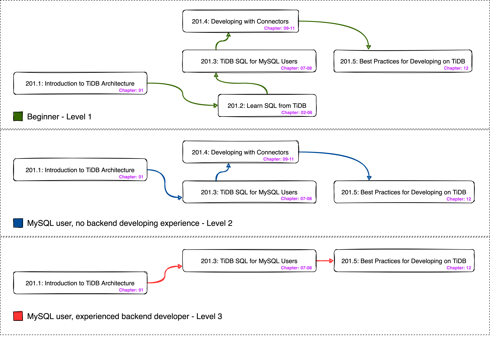

# TiDB SQL for Developers Course Lab
+ Caution:
  + All files and scripts provide no production warrenty, use them at your own risks.
  + Please ask your instructor for the guidance about how to use the artifacts in this repository.

# TiDB SQL for Developers 课程实验
+ 注意:
  + 所有文件和脚本都不提供生产保证, 使用它们需要您自担风险.
  + 请向培训老师咨询有关如何使用此仓库中的文件的指导.

**************************************************************************************
