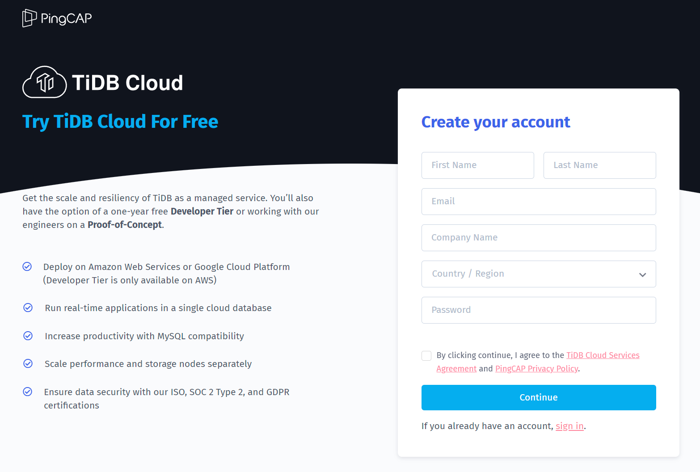
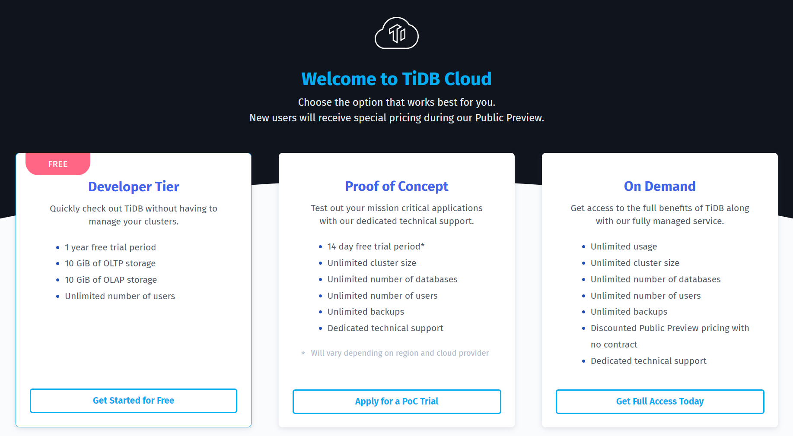
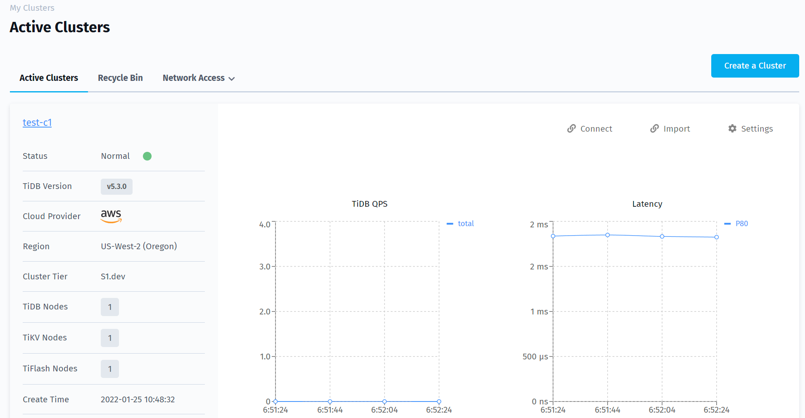
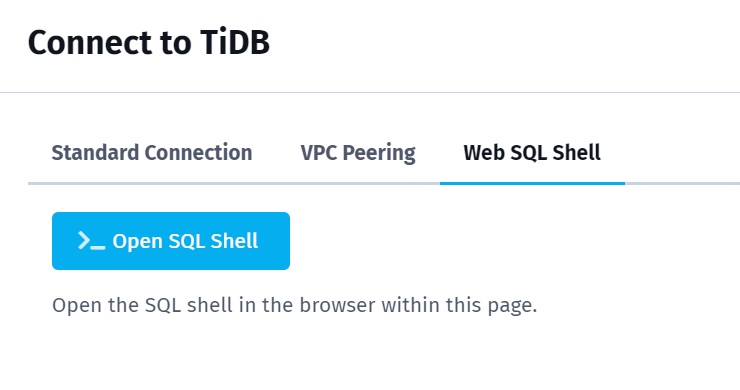
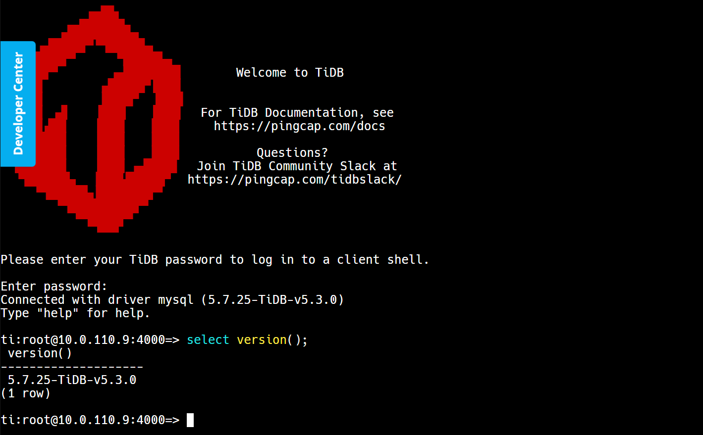

# **实验 1d: 注册并使用 `TiDB Cloud Developer Tier` 作为实验环境**

## 目的
部署测试目的 TiDB 集群，作为本课程的实验基础。

## 适用场景
+ 在 TiDB Cloud 中部署一个免费的测试集群。
+ 具备互联网连接。

## 步骤

****************************
#### 1. 注册 TiDB Cloud: 打开浏览器，访问 `https://tidbcloud.com`，点击 `Sign up` 完成注册并登录

****************************
#### 2. 选择 Free Developer Tier: 点击 `Get Started for Free`

****************************
#### 3. 创建测试集群: 为 Cluster 取名、设置密码、选择云供应商、选择区域，点击下方的 `Submit`，观察创建步骤，等待大约 5-15 分钟，直到 `Status` 从 `Creating` 变为 `Normal`

****************************
#### 4. 点击右侧的 `Connect`，选择 `Web SQL Shell`，然后点击 `>_ Open SQL Shell`

****************************
#### 5. 输入在步骤3设置的密码登录，查看数据库版本，并保留会话

